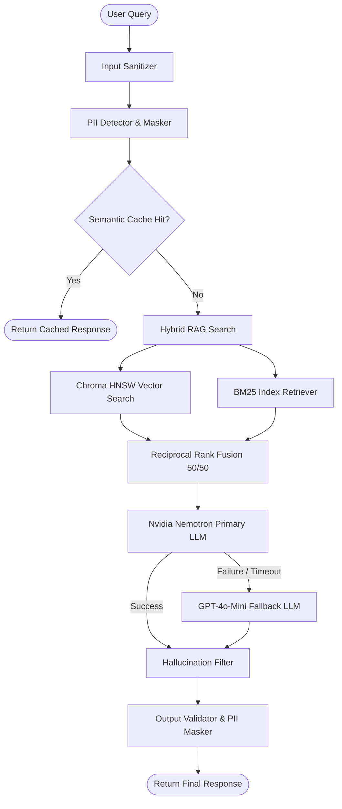

# CONTEXT: Advanced Cognitive RAG Hub

The **Advanced Cognitive RAG Hub** is designed to address key production engineering challenges when deploying Retrieval-Augmented Generation (RAG) pipelines in real-world environments. Standard RAG architectures often suffer from latency issues, lack of security filtering, API instability, and hallucinated answers. This project implements production-level design patterns to mitigate these risks.

---

## 🎯 Project Objectives

1. **Precision & Grounding**: Mitigate LLM hallucinations using a hybrid search algorithm combined with reflective verification systems.
2. **Reliability & Availability**: Protect external API calls (Nvidia, OpenAI) with backoff retries, fallback loops, and circuit breakers.
3. **Data Privacy & Protection**: Guarantee user data protection through automatic sanitization and PII masking.
4. **Observable Metrics**: Log pipeline performance in a structured format (JSON) and expose operational key performance indicators.
5. **Interactive Visualization**: Display indexed chunks inside a 3D coordinate space to understand document structure and retrieval behavior.

---

## 🏗️ System Overview

